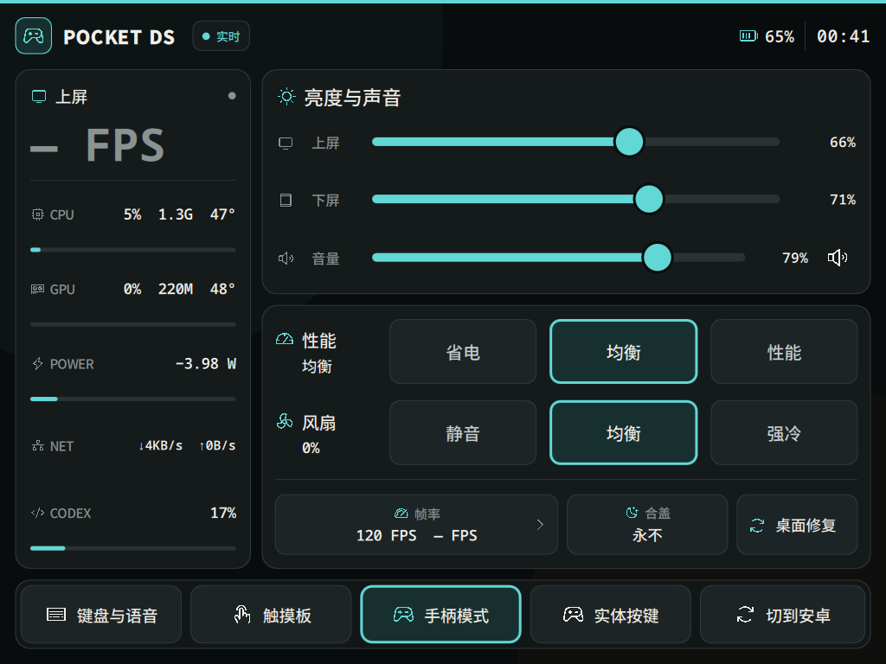

# Pocket DS Linux Kit

让 AYANEO Pocket DS 的双屏、触摸、手柄和 Linux 桌面一起好用。

这里公开下屏 Panel、屏幕键盘、触控板、手柄模式，以及显示、音频、风扇、电源和合盖相关的系统修复源码。配套内核与设备树补丁、软件包修补和 SD 镜像构建工具也在仓库中。

**[下载 SD Alpha3 测试镜像与源码](https://github.com/bobsixsixsix-boop/pocketds-linux-kit/releases/tag/sd-alpha3-20260908)** · 约 1.8 GB · 16 GB 或更大备用 SD 卡。

这是完整的 Fedora 44 KDE / AArch64 系统镜像，解压后可写入 SD 卡；设备需已安装支持 Linux 的 ROCKNIX ABL。**整张新镜像尚未完成 Pocket DS 实机开机验收，请按 Alpha 测试版使用。** 写卡步骤、校验和及详细验证范围见 Release。

[安装已有系统](docs/INSTALL.md) · [语音 API 配置](docs/VOICE-API.md) · [支持与已知限制](docs/SUPPORT.md) · [开发说明](docs/DEVELOPMENT.md)

截图采集于 2026-09-08，展示已有设备上的版本。[截图来源](docs/screenshots/README.md)记录了采集版本，不代表新 SD 镜像已经实机验收。

## 公开范围

| 部分 | 内容 |
| --- | --- |
| 下屏 Panel | 系统状态、双屏亮度、音量、无线连接、性能档与常用操作 |
| 键盘与触控板 | 中文输入、终端快捷键、窗口移上屏、指针、滚动、拖动和独立左右键 |
| 手柄 | 手柄／鼠标模式切换、实体按键测试与游戏输入集成 |
| 系统适配与修复 | 显示恢复、音频、风扇、电源与合盖策略；对应内核、设备树和用户空间补丁 |
| 构建与维护 | 安装、升级、撤回、离线测试、软件包修补和 SD 镜像构建工具 |
| 可选集成 | 用户自备语音 API，以及外部桌面应用和游戏运行时入口 |

各组件保留自己的验证状态。实验目录中尚未验收的补丁，不表示已安装到日用设备或默认启用于 SD 镜像；具体范围见 [SUPPORT.md](docs/SUPPORT.md) 与 [KNOWN-ISSUES.md](docs/KNOWN-ISSUES.md)。

## 语音与个人配置

语音使用用户自备的 [OpenAI 兼容音频转写 API](docs/VOICE-API.md)。按说明配置自己的完整 HTTPS 转写地址、模型和 API Key；项目不预置语音服务或共享密钥，普通键盘无需配置语音即可使用。

公开仓库从审阅后的干净源码导出建立新的 Git 历史，不携带维护者原私有开发历史。个人语音服务配置、密钥、登录资料、Wi-Fi 记录和存档不随项目提供。

Steam、ES-DE、Moonlight 等集成入口不代表这些应用已随项目分发。外部账号、游戏、ROM、BIOS、模型与个人壁纸由使用者自行准备。

## 使用源码

当前适配基线是 **AYANEO Pocket DS、Fedora 44 / AArch64、KDE Plasma Wayland**，配套 Pocket DS 定制内核与设备支持包。

已有可正常工作的 Pocket DS Linux 环境，可按[安装、升级与撤回](docs/INSTALL.md)更新 Kit。安装器依赖既有 `pocketds` 桌面账户和布局，执行前请核对指南中的依赖与改动范围。

| 需要 | 入口 |
| --- | --- |
| 理解组件和调用关系 | [架构](docs/ARCHITECTURE.md) |
| 运行测试、修改代码 | [开发说明](docs/DEVELOPMENT.md)、[贡献指南](CONTRIBUTING.md) |
| 阅读 SD 镜像构建流程 | [构建说明](packaging/sd-image/README.md) |
| 更新设备支持包 | [更新策略](docs/UPDATE-POLICY.md) |
| 报告问题 | [报告问题](CONTRIBUTING.md#报告问题)；敏感信息按 [SECURITY.md](SECURITY.md)处理 |

具备依赖的 Linux 开发环境可运行 `make lint`、`make test`。完整检查包含 Linux 专用 C/C++ 代码；macOS 可运行安装指南列出的最小 Python／模拟测试。实际触摸、音频和睡眠行为仍需设备验证。

## SD Alpha3 测试镜像

Alpha3 包含完整 KDE 系统、上述桌面组件和已选定的系统适配。它从干净系统构建，首次进入桌面提示设置本机密码，保留本地自动登录，SSH 和深度睡眠默认关闭。需要 **16 GB 或更大的备用 SD 卡**，以及预先安装的 ROCKNIX ABL；单独写卡不会安装 ABL。

本次同步了键盘切换符号页后窗口缩小的修复。该修复已在原日用设备完成页面切换与触摸确认；新 SD 镜像仍需单独验收。手柄组件保留键盘震动及 Pocket DS 日用模式，移除了未使用且授权说明不完整的 USB `deck` 后端，保留 `deck-uhid`，并补入完整第三方许可通知与对应源码材料。

镜像构建源码基线为 `b7f5e71f03a9a37acab4813ecbd1a9c7c0b3ef75`，对应 1,451 个文件。运行代码版本报告 **1,801 项 Python 测试，其中 5 项因环境条件跳过**，脚本检查通过；随后补入许可证和清单，运行代码未变，最终版本的安装清单、镜像封装和源码导出另有 **76 项针对性检查**通过。精确版本关系见验证附件。

实际镜像的分区、文件系统、启动文件、运行文件来源及首次使用状态均通过独立只读检查，压缩包完整解压后的哈希也已核对。317 个基础内核模块沿用既有验收文件，额外 RFCOMM 蓝牙模块为新构建，只完成静态检查。

首次 SD 启动、扩容、首次桌面与密码窗口、双屏触摸、音频、无线连接、重启和恢复尚未在新卡实测。此版本是未签名的 Alpha 工程构建，Fedora/COPR 仓库也不是不可变快照，不保证整个系统按字节复现。

下载 [Release 附件](https://github.com/bobsixsixsix-boop/pocketds-linux-kit/releases/tag/sd-alpha3-20260908) 时，请核对随附 `SHA256SUMS`；源码、构建材料、InputPlumber 完整源码、第三方源码及验证记录一并提供。

## 许可证与来源

项目原创代码与文档默认采用 **GPL-3.0-or-later**，见 [LICENSE](LICENSE) 与 [NOTICE](NOTICE)。文件已有许可声明、上游版权和补丁作者信息继续保留；第三方来源与范围见 [THIRD-PARTY.md](THIRD-PARTY.md)，对应许可证位于各组件目录和 [LICENSES](LICENSES)。

内核、固件、Fedora 软件包及其他第三方程序分别适用原有授权条件；项目默认许可证不改变它们的 GPL 版本选项、MIT、BSD 等条款。ROCKNIX 开机标志另适用 CC BY-NC-SA 4.0 的署名、非商业和相同方式共享条件，详见 Release 附带通知。

`docs/release/` 和嵌入构建材料中的源码快照保留了准备过程与当时的发布状态；当前可用内容以本页及 Releases 实际附件为准。镜像对应的冻结源码以 Release 源码附件和逐文件清单为准；本页的发布说明更新不改变镜像内的源码快照。Alpha 发布不代表稳定版验收完成。
