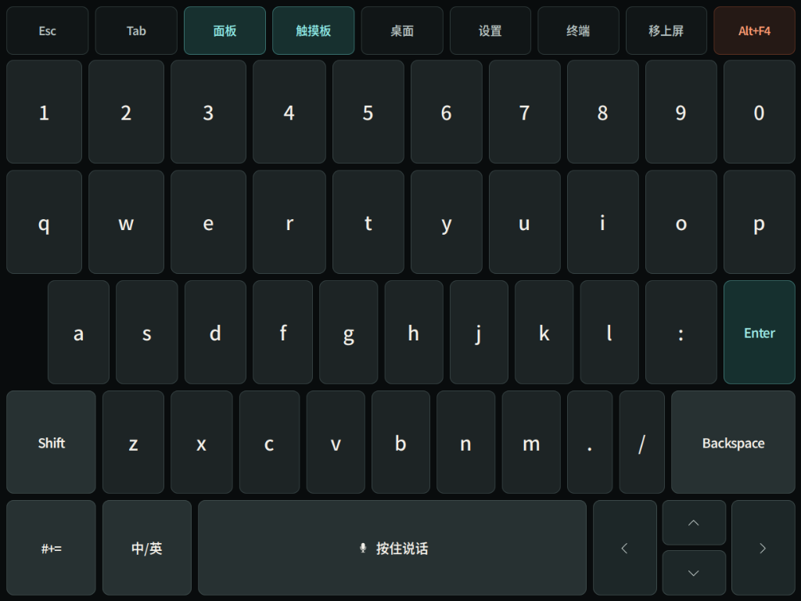
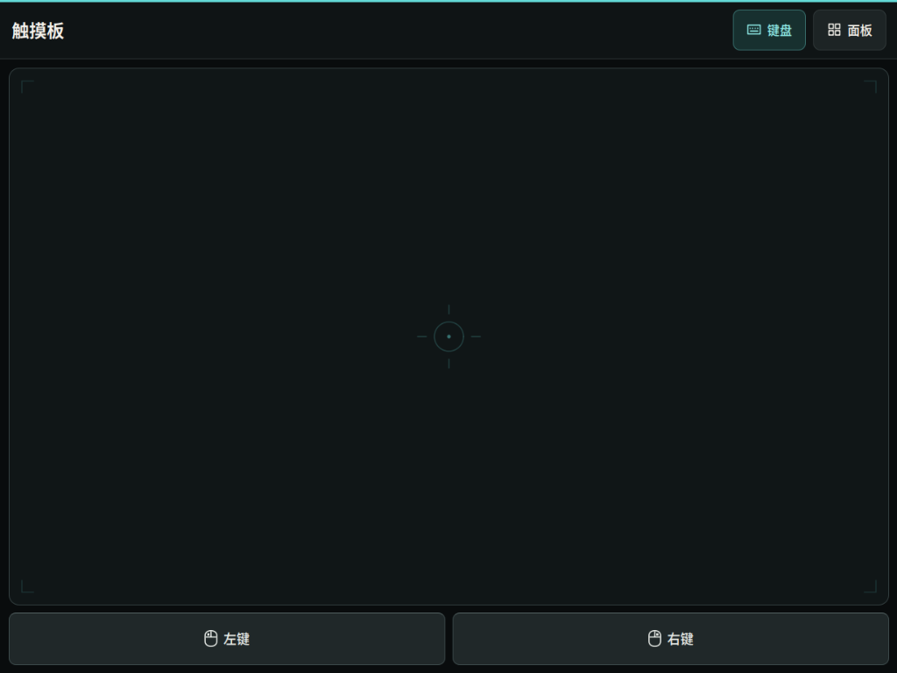
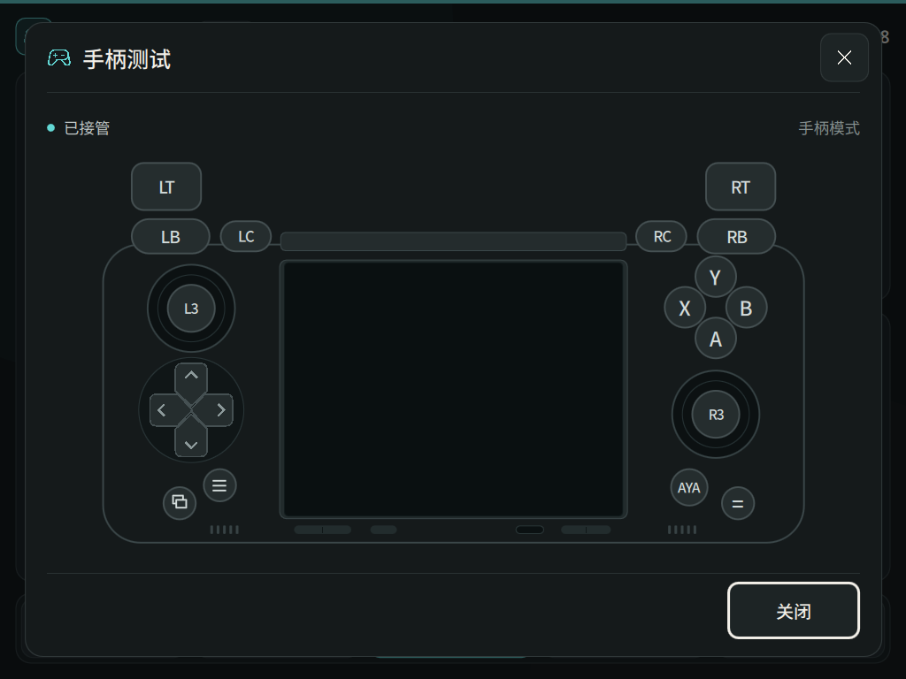

# Pocket DS Linux Kit

让 AYANEO Pocket DS 的双屏、触摸、手柄和 Linux 桌面一起好用。

这里维护下屏控制面板、触摸键盘、手柄模式，以及显示、音频和电源的设备适配源码。
项目已在维护者的 Pocket DS 上持续使用和实测。当前公开范围是**源码预览**：
可以阅读、修改和运行离线测试；安装面向已经工作的 Pocket DS Linux 环境。
不提供可刷写系统镜像或普通 Fedora 的通用安装包。

下屏控制面板，将系统状态、双屏亮度、音量和常用操作放在手边。
截图采集于 **2026-09-08**，点击可查看原图；[采集版本与来源说明](docs/screenshots/README.md)。

## 功能

| 部分 | 功能 |
|---|---|
| 下屏 Panel | 双屏亮度、音量、无线连接、性能档、充放电功率、帧率与合盖设置 |
| 触摸键盘 | 中文输入、终端快捷键、下屏应用窗口移到上屏、可选语音输入 |
| 触摸板 | 指针移动、独立左右键、多指滚动与拖动；与键盘切换 |
| 手柄 | 手柄／鼠标模式切换、按键测试与实时反馈、游戏输入集成 |
| 双屏与电源 | 屏幕状态恢复、独立亮度保持、受内核和运行状态检查约束的合盖睡眠 |
| 音频 | 扬声器与内置麦克风配置、蓝牙／USB 麦克风录音路径 |
| 桌面与游戏 | Fcitx5/Rime、Steam、ES-DE、Moonlight 等外部程序的启动和输入集成 |

语音使用用户自备的 [OpenAI 兼容转写 API](docs/VOICE-API.md)，自行配置地址、API Key 与模型。
项目没有默认语音服务或共享密钥。Codex 登录、游戏运行时、ROM、BIOS、模型与个人壁纸
同样由使用者自行准备。
集成功能不代表这些服务或内容随项目分发。没有语音授权时，普通键盘输入仍可使用。

## 实机界面

### 键盘与触摸板

| 触摸键盘 | 触摸板 |
|---|---|
|  |  |
| 中文输入、终端快捷键，一键把下屏应用窗口移到上屏。 | 大面积触摸区与独立左右键，随时切回键盘或 Panel。 |

### 手柄测试

从 Panel 的“实体按键”打开，临时接管手柄输入，按下实体按键即可查看对应位置的反馈。
下面展示测试页打开后的待输入状态。

## 支持范围

当前验证基线是 **AYANEO Pocket DS、Fedora 44/aarch64、KDE Plasma Wayland**，
配套 Pocket DS 定制内核和硬件支持包。安装器还依赖既有的 `pocketds` 桌面账户与布局。
具体前提见 [安装、升级与撤回](docs/INSTALL.md)。

维护者设备已有双屏、触摸、输入模式、合盖唤醒、语音和重启后中文输入的实测记录。
另一台设备从头安装、其他发行版和全部外设组合尚未完成验证。长期待机、历史 GPU
故障和一次晚期关机停顿仍有未决范围，见 [支持与已知限制](docs/SUPPORT.md)。

## 开始使用

| 你想做什么 | 从这里开始 |
|---|---|
| 阅读代码、尝试修改 | [架构](docs/ARCHITECTURE.md)、[开发说明](docs/DEVELOPMENT.md)、[贡献指南](CONTRIBUTING.md) |
| 在电脑上先检查源码 | [最小离线检查](docs/INSTALL.md#最小离线检查)；不需要设备或访问码 |
| 更新已有 Pocket DS Linux 环境 | [安装、升级与撤回](docs/INSTALL.md)，先核对基线与改动范围 |
| 更新发行版或设备支持包 | [更新策略](docs/UPDATE-POLICY.md) |
| 报告问题 | [贡献指南](CONTRIBUTING.md#报告问题)；敏感问题按 [SECURITY.md](SECURITY.md) 处理 |
| 准备发布 | [源码公开清单](docs/release/SOURCE-RELEASE.md)；系统镜像另按 [镜像发行清单](docs/RELEASE-CHECKLIST.md) 验收 |

具备依赖的 Linux 开发环境可运行 `make lint`、`make test`。完整检查包含 Linux
专用 C/C++ 代码；macOS 可运行指南列出的最小 Python/模拟测试。`make check` 还会在
Pocket DS 上检查运行状态。这些检查均不替代实际触摸、音频和睡眠验收。

## 目录

| 目录 | 内容 |
|---|---|
| `components/control-panel`、`components/keyboard`、`components/touchpad` | 下屏界面与输入 |
| `components/inputplumber`、`components/game-runtime` | 手柄、鼠标模式与游戏会话 |
| `components/audio`、`components/fan`、`components/system` | 音频、性能、显示与系统策略 |
| `components/locale`、`components/codex-quota` | 中文输入与可选额度显示 |
| `components/emulation`、`components/steam`、`components/moonlight` 等 | 外部程序集成 |
| `scripts`、`tests` | 安装、检查、恢复工具与自动测试 |
| `docs/research`、`experiments`、`tools/kernel-ab` | 调查和设备实验，使用前核对日期与适用基线 |
| `packaging` | 软件包和系统镜像的构建与验签工作 |

## 许可证与发布边界

项目原创内容默认采用 **GPL-3.0-or-later**，见 [LICENSE](LICENSE) 与 [NOTICE](NOTICE)。
文件已有的许可声明及第三方许可证继续适用；来源与范围见 [THIRD-PARTY.md](THIRD-PARTY.md)。

公开候选从指定源码提交独立导出，排除个人访问码、个人壁纸、预编译观察器和维护机记录，
不携带原私有 Git 历史。原始开发仓库曾包含个人配置，不能直接改成公开仓库。
发布平台与正式下载入口另行确定；许可证选择不表示镜像或第三方二进制已经完成发行验收。
